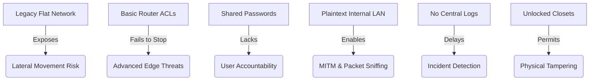
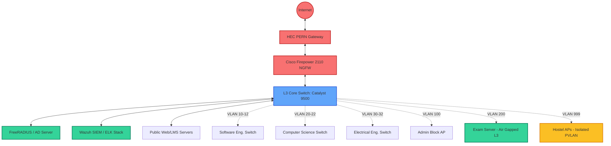
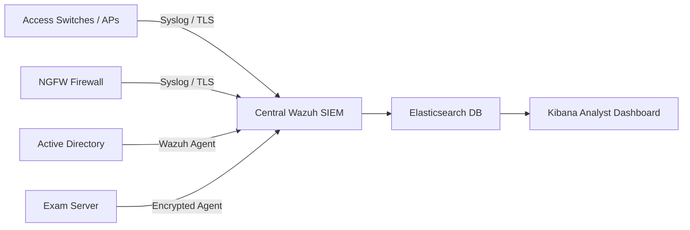
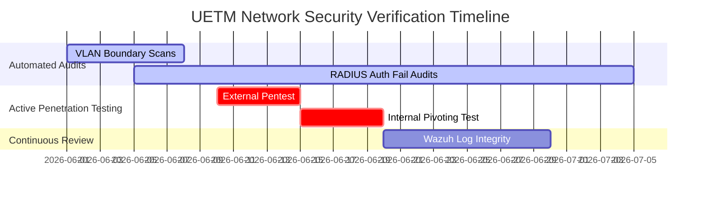

# UET Mardan Secure Campus Network Architecture
### Information Security Course Project (CEP) Report
**Institution:** University of Engineering and Technology, Mardan (UETM)  
**Author:** Haseen Ullah (mr-haseen-ullah)  
**Interactive Dashboard:** [https://iseccep.haseenullah.live](https://iseccep.haseenullah.live)

---

## 1. Executive Summary

This report presents a comprehensive, modern, and highly secure network architecture redesign for the **University of Engineering and Technology Mardan (UETM)** campus. 

The existing network infrastructure at UETM suffers from typical legacy campus network vulnerabilities: it operates on a flat topology with no internal boundary controls, lacks specialized edge security mechanisms, uses unencrypted internal protocols, and has no centralized logging or identity management. A breach in a single untrusted sector (like a student hostel or guest Wi-Fi) exposes the entire institution's critical resources—including the Examination Vault and Administration databases—to severe lateral movement risks.

To address these vulnerabilities, this project proposes a **Defense-in-Depth** and **Zero Trust** security framework. The core of this redesign is micro-segmentation using over 35 virtual LANs (VLANs), Next-Generation Firewall (NGFW) deployment at the campus boundary, IEEE 802.1X Network Access Control (NAC) with Active Directory integration, end-to-end TLS 1.3 encryption, and centralized SIEM log monitoring.

To demonstrate and validate the proposed design, an interactive **Campus Blueprint & Threat Simulation Engine** was built. The dashboard models the exact physical layout of UET Mardan, simulates live traffic flows, and runs real-time security simulations demonstrating how our proposed defenses successfully stop advanced attack vectors (DDoS, Spear Phishing, Lateral Movement, and Rogue APs).

---

## 2. Existing Layout Weaknesses & Risk Analysis

The original network layout at UETM was evaluated against standard security benchmarks (CIS Controls, NIST SP 800-53). Six critical architectural flaws were identified:

| Weakness Area | Technical Description | Risk Level | Potential Impact |
| :--- | :--- | :---: | :--- |
| **Flat Network Topology** | The entire campus (Software, CS, EE, Admin, Hostels, and Guests) operates on a single flat IP space. No firewalls or Access Control Lists (ACLs) isolate department subnets internally. | **CRITICAL (95%)** | A single malware infection on a student laptop in the Hostel can propagate laterally to compromise the administrative database or the Examination Vault. |
| **Legacy Perimeter Defense** | Edge security is handled by a basic boundary router utilizing stateless L3/L4 Access Control Lists (ACLs). There is no deep packet inspection or threat signature detection. | **HIGH (88%)** | Inability to block modern application-layer attacks, SQL injections on university portals, volumetric DDoS floods, or advanced persistent threats (APTs). |
| **Shared / Weak Authentication** | Wireless networks utilize pre-shared keys (WPA2-PSK) shared among hundreds of users. There is no individual identity validation or machine posture checking before access. | **HIGH (82%)** | Rogue devices can connect to the internal network undetected. Zero audit accountability for which specific user or device performed an action. |
| **Plaintext Transmission** | Critical academic resources, examination portals, and local administrative tools operate over unencrypted HTTP or legacy protocols (Telnet, SNMPv1). | **HIGH (75%)** | Attackers on the local network can capture passwords, sensitive student records, and exam papers in transit via Man-in-the-Middle (MITM) and packet sniffing tools. |
| **Blindspot in Logging** | Log directories are dispersed across individual servers and switches. There is no central collection server, log correlation mechanism, or real-time alert system. | **MEDIUM-HIGH (70%)** | Security breaches go unnoticed for weeks. Lack of chronological, tamper-evident log chains makes forensic investigation and post-incident response impossible. |
| **Physical Infrastructure Gaps** | Network access switches are housed in unlocked closets. Server room entry relies on simple mechanical keys without secondary biometric or card auditing. | **MEDIUM (55%)** | Unauthorized physical access allows students to connect rogue access points, bypass network controls, or physically manipulate switch ports. |

---

## 3. Proposed Secure Network Architecture

The proposed architecture adopts a multi-layered **Defense-in-Depth** and **Zero Trust** strategy to ensure that if one defense tier fails, auxiliary controls are in place to intercept the threat.

### A. Next-Generation Edge Firewall (NGFW)
At the HEC PERN (Pakistan Education & Research Network) 1Gbps boundary, we deploy a **Cisco Firepower 2110 Next-Generation Firewall**. The NGFW is configured with:
*   **Deep Packet Inspection (DPI)**: To analyze payload contents up to Layer 7.
*   **Intrusion Prevention System (IPS)**: Suricata-based threat detection engine to block exploit signatures.
*   **Encrypted Traffic Analytics**: Identifying malware behavior inside TLS/SSL streams without full decryption overhead.
*   **Demilitarized Zone (DMZ)**: Isolating external-facing services (University Web Portal, LMS, DNS, and Email Relays) from the internal campus LAN.

### B. Micro-Segmentation & VLAN Schema
We partition the campus physical layout into distinct, isolated logical networks using **IEEE 802.1Q VLAN encapsulation** on a L3 Core Switch (**Cisco Catalyst 9500**).

| VLAN ID | Subnet Area | Allocation & Purpose | Security Access Policies |
| :---: | :--- | :--- | :--- |
| **1** | `10.0.0.0/24` | **Server Room & NOC**: Core switches, firewalls, virtualization hosts. | Access restricted to verified IT administrators via encrypted SSHv2 (key-based) only. |
| **10 - 12** | `10.10.0.0/22` | **Software Engineering Block**: Faculty, labs, student workstations. | Inter-VLAN routing allowed to local library and internet; blocked from Admin and Exam vaults. |
| **20 - 22** | `10.20.0.0/22` | **Computer Science Block**: Faculty offices, GPU labs, CS classrooms. | Inter-VLAN routing allowed to local library and internet; blocked from Admin and Exam vaults. |
| **30 - 32** | `10.30.0.0/22` | **Electrical Engineering Block**: PLC/SCADA systems, research labs. | SCADA controllers isolated with strict MAC-limiting. No internet access allowed for PLC subnets. |
| **40 - 42** | `10.40.0.0/22` | **Civil Engineering Block**: Structural labs, CAD computers. | Standard lab routing. Heavy QoS throttling applied during high-load modeling runs. |
| **50 - 52** | `10.50.0.0/22` | **Mechanical Engineering Block**: CNC controllers, IoT automation. | OT network isolated. Access to CNC controller subnets restricted via strict source-IP filtering. |
| **60 - 62** | `10.60.0.0/22` | **Telecom Engineering Block**: RF research labs, standard labs. | Isolated RF lab network to prevent external RF leakage or unauthorized wireless bridging. |
| **70** | `10.70.0.0/24` | **Central Library**: Digital catalogs, study hall public Wi-Fi. | Enforced Content Filtering (Web proxy). Dynamic bandwidth allocation to prevent resource abuse. |
| **80** | `10.80.0.0/24` | **Artificial Intelligence Center**: GPU clusters, AI modeling hosts. | High-bandwidth trunking. Isolated research subnet to prevent model leakage or external tampering. |
| **90** | `10.90.0.0/24` | **Natural Sciences & Humanities**: Classroom and faculty PCs. | Standard academic internet access. Blocked from administrative subnets. |
| **100** | `10.100.0.0/24` | **Admin Block**: VC Office, finance, registrar, HR databases. | Blocked from all student/lab subnets. Access requires dynamic 802.1X biometric authentication. |
| **101** | `10.100.1.0/24` | **Seminar Hall**: Conference portals, streaming systems. | Guest captive portal active. QoS optimized for real-time video conferencing and webcasts. |
| **150** | `10.150.0.0/24` | **Staff Residence**: Faculty residential housing. | WPA3 Enterprise enforced. Secure site-to-site IPsec VPN required to access internal campus resources. |
| **200** | `10.200.0.0/28` | **Examination Vault**: Local examination portal and database. | **Air-gapped database model**. Zero direct routing to/from the internet. AES-256 data-at-rest encryption. |
| **998** | `192.168.98.0/24` | **Perimeter Security**: CCTV cameras, biometric scanners, gates. | Isolated. Video feeds route exclusively to NVR in NOC. Dynamic ARP Inspection (DAI) active. |
| **999** | `192.168.1.0/22` | **Student Hostels & Guest Wi-Fi**: Resident halls, cafeteria. | **Private VLANs (PVLAN)** enabled. Hosts cannot communicate with each other or any internal VLAN. |

### C. 802.1X Network Access Control (NAC)
To prevent unauthorized devices from connecting to campus switchports or Wi-Fi APs:
1.  **Backend Integration**: A centralized **FreeRADIUS** server is deployed and synchronized with the university's **Active Directory** database.
2.  **Access Protocol**: Switched ports and Access Points require **IEEE 802.1X (EAP-TLS or PEAP)** authentication.
3.  **Dynamic VLAN Assignment**: Upon authentication, the RADIUS server sends an access-accept message with a VLAN attribute, dynamically assigning the user's device to their specific department's VLAN.
4.  **Guest Isolation**: Devices failing authentication are dynamically redirected to a **VLAN 999 Captive Portal** with limited outbound web access only.

### D. Cryptographic Controls & Zero Trust
*   **Internal Encryption**: Every web portal operating inside the campus LAN (LMS, grading database, exam software) enforces **TLS 1.3** and redirects HTTP traffic using HSTS.
*   **Core Administrative Security**: Network administration (accessing switches, firewalls, and servers) mandates **SSHv2 with RSA-4096 cryptographic keys** and multi-factor authentication (MFA). Telnet and SNMPv1/v2 are completely disabled, replaced by SNMPv3.
*   **DNS Security**: Secure DNS using **DNS-over-HTTPS (DoH)** and **DNSSEC** is implemented to prevent DNS hijacking, poisoning, or spoofing attacks on campus devices.

---

## 4. Centralized Monitoring & SIEM/SOC

To eliminate the university's logging blindspots, we establish a **Security Operations Center (SOC)** powered by the open-source **Wazuh SIEM + ELK Stack**.

1.  **Log Aggregation**: Wazuh lightweight agents are deployed on critical endpoints (Active Directory, Exam Servers, Web Hosts). Network hardware (Cisco switches, APs, and NGFW) forward logs securely via encrypted **Syslog (TLS)** to the SIEM.
2.  **Real-Time Correlation**: Wazuh actively correlates event records to detect suspicious sequences, such as:
    *   *Credential Harvesting*: A sudden spike of failed login attempts on an Active Directory host followed by a successful login.
    *   *Lateral Movement*: A device in the Hostel (VLAN 999) attempting port scans against the internal Exam Vault range (`10.200.0.0/28`).
    *   *Rogue Devices*: An unauthorized MAC address attempting multiple EAP auth cycles.
3.  **Alerting & SOAR**: Critical alerts are automatically triaged, notifying the IT security response team and triggering automated firewall rate-limiting rules.

---

## 5. Interactive Dashboard & Threat Simulation Analysis

To demonstrate the efficacy of our proposed defenses, we developed an interactive **Campus Network Topology & Threat Simulation Dashboard**, hosted at [iseccep.haseenullah.live](https://iseccep.haseenullah.live). 

The dashboard provides a visual, real-time representation of the campus and simulates four critical attack vectors:

### A. Volumetric DDoS Flood
*   **Attack Vector**: Botnets flood the main gateway with high-volume UDP/ICMP traffic, saturating the HEC PERN uplink and causing an immediate denial of service for university web applications.
*   **Proposed Defense Response**: 
    1.  The **Cisco Firepower NGFW** detects the sudden bandwidth spike (simulated from 2.4 Gbps to 14.7 Gbps).
    2.  Rate-limiting policies are dynamically applied at the perimeter.
    3.  A BGP Flowspec route trigger is sent to the HEC upstream provider, scrubbing the malicious volume and keeping the internal campus web services online.

### B. Spear Phishing Campaign
*   **Attack Vector**: An attacker sends a highly targeted email containing a credential-harvesting link to a university faculty member.
*   **Proposed Defense Response**:
    1.  The mail transfer agent routes inbound email through the NGFW cloud sandboxing filter, stripping malicious scripts.
    2.  If the user clicks the link, the **NGFW DNS Filtering** intercepts the lookup, blocking access to the external host.
    3.  **Active Directory (RADIUS)** audits the failed/successful login flows, and **CrowdStrike EDR** restricts browser memory access to block session theft.

### C. Lateral Movement & Pivoting
*   **Attack Vector**: A compromised student laptop located in the hostel tries to scan the network, discover administrative hosts, and pivot toward the Examination Vault database server.
*   **Proposed Defense Response**:
    1.  The L3 Core Switch enforces the **VLAN 999 Private VLAN (PVLAN)** boundary, completely preventing the compromised host from communicating with neighboring student machines.
    2.  Inter-VLAN Access Control Lists (ACLs) silently drop any packet originating from the hostel subnet headed toward the Exam Vault (`10.200.0.0/28`).
    3.  The **Wazuh SIEM** triggers a high-severity alert for unauthorized internal scanning, and the core switch automatically disables the compromised host's access port.

### D. Rogue Access Point Deployment
*   **Attack Vector**: A student plugs an unauthorized, cheap Wi-Fi router into an unlocked Ethernet wall jack in the Civil Engineering Block to bypass authentication and capture credentials (Evil Twin attack).
*   **Proposed Defense Response**:
    1.  The Civil access switch immediately detects a secondary MAC address on the port that did not complete **802.1X NAC authentication**.
    2.  The switch triggers a **Port Security violation** and transitions the port into an `err-disable` (shutdown) state.
    3.  An alert is dispatched to the SIEM console with the exact switch, port number, and building location for physical recovery.

---

## 6. Verification and Testing Plan

To ensure the newly deployed network architecture maintains its security posture over time, the following verification program is established:

### A. Automated Boundary Scans
*   **Tools**: Nmap, Nessus.
*   **Process**: Deploy a testing device in the Hostel VLAN (VLAN 999) and run exhaustive TCP/UDP port scans against all IP ranges of the core infrastructure (`10.0.0.0/8`).
*   **Success Criteria**: Zero packets should cross the VLAN boundary; all probes to the `10.100.0.0/24` (Admin) and `10.200.0.0/28` (Exam) networks must return `Filtered` or fail to route.

### B. IEEE 802.1X EAP Verification
*   **Tools**: Wireshark, Radtest.
*   **Process**: Connect a non-university laptop to a lab switch port and attempt to gain an IP address without an active Active Directory credential certificate.
*   **Success Criteria**: The device must be refused a standard IP, placed in an isolated guest VLAN (`192.168.1.0/24`), and forced to display a captive portal.

### C. Pentesting Lateral Pivots
*   **Process**: Engage an independent cybersecurity auditor to simulate an active insider threat (compromised workstation in Software Engineering). The auditor will attempt to sniff traffic or access administrative interfaces.
*   **Success Criteria**: No plaintext credentials must be readable in transit, all Telnet connections must fail, and the Wazuh SIEM dashboard must flag the activity within 30 seconds of execution.

---

## 7. Conclusion

The proposed secure network architecture transition effectively mitigates UET Mardan’s structural cyber risks. By shifting from a legacy flat topology to a modern, micro-segmented, and Zero Trust-oriented infrastructure, critical university assets—such as administrative records and sensitive examination databases—are highly protected against lateral threats, volumetric perimeter floods, and physical interface hijacking. 

Combined with centralized event monitoring via Wazuh SIEM, this framework establishes a highly resilient cyber posture, ensuring a secure and reliable academic environment for the university’s students, faculty, and administrative staff.
